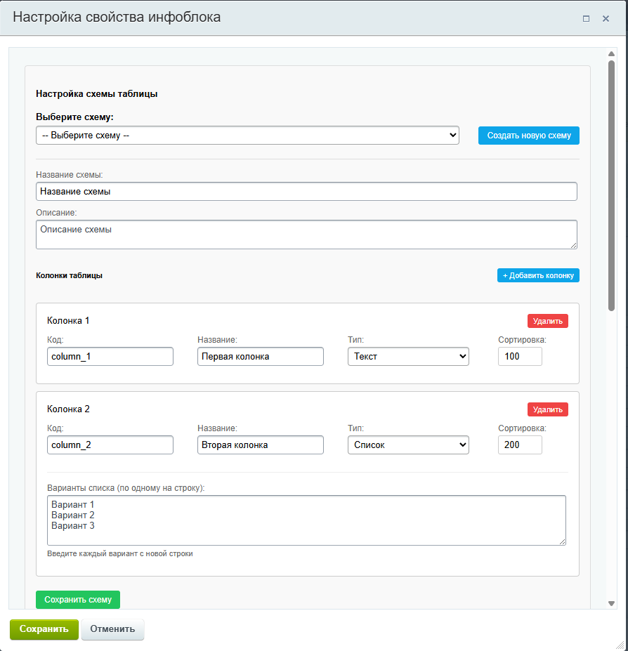
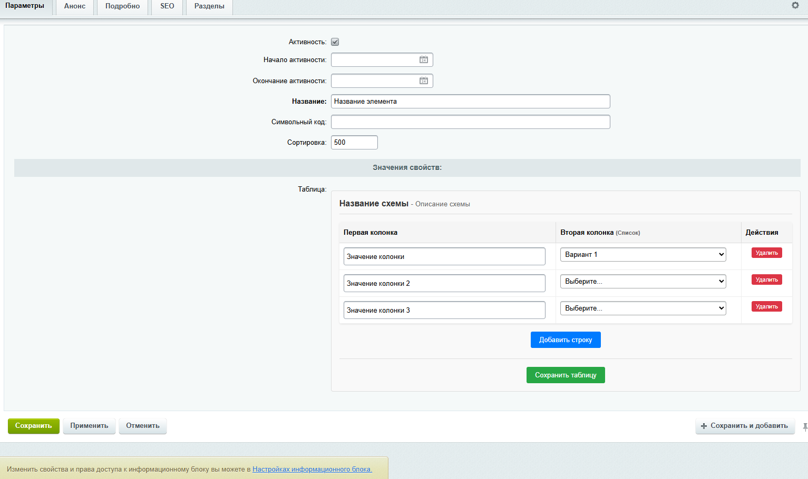

# 🚀 Grebion Tables Module для Bitrix D7

> **Внимание!** 🔥 Этот проект находится в активной разработке и создан как демонстрация навыков разработки на Bitrix D7. Не судите строго - впереди еще много интересного! 😄

## 📋 О проекте

**Grebion Tables** - это не просто "еще одни таблицы" для Bitrix! 💪 Это мощнейший инструмент для работы с табличными данными, построенный с использованием современных паттернов проектирования и лучших практик Bitrix D7.

### 🎯 Цель проекта
Продемонстрировать глубокое понимание:
- **Bitrix D7 ORM** и архитектуры ядра
- **Паттернов проектирования** (Repository, Service Layer, Factory)
- **SOLID принципов** разработки
- **Компонентного подхода** Bitrix

---

## 🌟 Ключевые особенности

### 🔥 Это больше чем таблицы!
- **🎨 Гибкие схемы** - создавайте любые структуры данных
- **🔍 Мощный поиск** - готов к интеграции с Elasticsearch
- **📊 REST API готовность** - архитектура заточена под API
- **📤 Экспорт данных** - любой сложности и формата
- **🚀 Высокая производительность** - оптимизированные запросы
- **🛡️ Безопасность** - валидация и права доступа

### 💎 Уникальность подхода
- **Динамические схемы** с JSON-конфигурацией
- **Типизированные колонки** (text, number, date, select, file, etc.)
- **Автоматическая валидация** данных
- **Связанные данные** через внешние ключи
- **Версионирование** изменений

---

## 📸 Как это выглядит

### Настройка схемы в свойствах инфоблока:


### Редактирование таблицы в элементе:


---

## 🏗️ Архитектура модуля

### 📁 Структура `/lib`

```
lib/
├── 🎭 iblockproperty/     # Интеграция с инфоблоками
│   └── TableProperty      # Пользовательский тип свойства
├── 🗃️ model/              # ORM модели (Data Layer)
│   ├── TableSchema        # Схемы таблиц
│   ├── TableData          # Экземпляры таблиц  
│   ├── Row                # Строки данных
│   ├── Column             # Колонки схем
│   └── Cell               # Ячейки данных
├── 🏪 repository/         # Паттерн Repository
│   ├── AbstractRepository # Базовый абстрактный класс
│   ├── TableRepository    # Работа с таблицами
│   ├── RowRepository      # Управление строками
│   ├── ColumnRepository   # Операции с колонками
│   └── CellRepository     # Манипуляции с ячейками
├── ⚙️ service/            # Бизнес-логика (Service Layer)
│   ├── TableService       # Основной сервис таблиц
│   ├── DataImportService  # Импорт данных
│   └── PermissionService  # Права доступа
└── 📋 result/             # Результаты операций
    └── TableResult        # Специализированный Result
``` 

### 🎯 Паттерны в действии

- **🏪 Repository Pattern** - изоляция работы с данными
- **⚙️ Service Layer** - инкапсуляция бизнес-логики  
- **🏭 Factory Method** - создание объектов
- **🎭 Strategy** - различные типы колонок
- **🔍 Observer** - отслеживание изменений
- **💍 Decorator** - расширение функциональности

---

## 🧩 Компоненты Bitrix

### 📝 `grebion:table.settings`
**Настройка схем таблиц**
- Создание и редактирование схем
- Управление колонками и их типами
- AJAX-интерфейс с валидацией

### ✏️ `grebion:table.editor` 
**Редактор табличных данных**
- Динамическое создание форм
- Автовалидация по схеме
- Поддержка всех типов полей

### 🎯 `grebion:table.selector`
**Выбор и просмотр таблиц**
- Список доступных таблиц
- Фильтрация и поиск
- Предпросмотр данных

---

## 🛠️ Технический стек

### 🔧 Backend
- **PHP 8.0+** с строгой типизацией
- **Bitrix D7 ORM** для работы с БД
- **Namespace** архитектура
- **PSR-4** автозагрузка
- **JSON Schema** валидация

### 🎨 Frontend  
- **Vanilla JavaScript** с модульной архитектурой
- **AJAX** для асинхронных операций
- **CSS Grid/Flexbox** для адаптивности
- **BX.ready** для инициализации

### 🗃️ Database
- **MySQL/MariaDB** с InnoDB
- **Внешние ключи** для целостности
- **Индексы** для производительности
- **JSON** поля для гибкости

--- 

## 🚧 Статус разработки

### ✅ Готово
- [x] 🗃️ Базовая ORM архитектура
- [x] 🎭 Пользовательский тип свойства
- [x] 📝 Компонент настройки схем
- [x] ✏️ Редактор таблиц
- [x] 🛡️ Валидация данных

### 🔄 В разработке  
- [ ] 🌐 REST API интерфейс
- [ ] 🔍 Полнотекстовый поиск
- [ ] 📊 Система экспорта
- [ ] 👥 Права доступа
- [ ] 📈 Аналитика и отчёты

---

## 🎓 Что демонстрирует проект

### 💪 Hard Skills
- Глубокое знание **Bitrix D7** и его возможностей
- Понимание **ORM** и работы с базами данных
- Владение **паттернами проектирования**
- Опыт создания **пользовательских типов свойств**
- Навыки **компонентной разработки**

### 🧠 Soft Skills  
- **Архитектурное мышление** - продуманная структура
- **Масштабируемость** - готовность к росту
- **Документирование** - понятный и читаемый код
- **Планирование** - поэтапная разработка

---

## 👨‍💻 Автор

Разработчик, который не просто пишет код, а создаёт архитектуру! 🏗️

**Специализация:** Bitrix D7, PHP, JavaScript, Architecture Design

---

> 💡 **P.S.** Этот проект - лишь вершина айсберга моих возможностей. Готов показать больше на реальных задачах! 🚀

---

*Сделано с ❤️ и большим количеством ☕*
